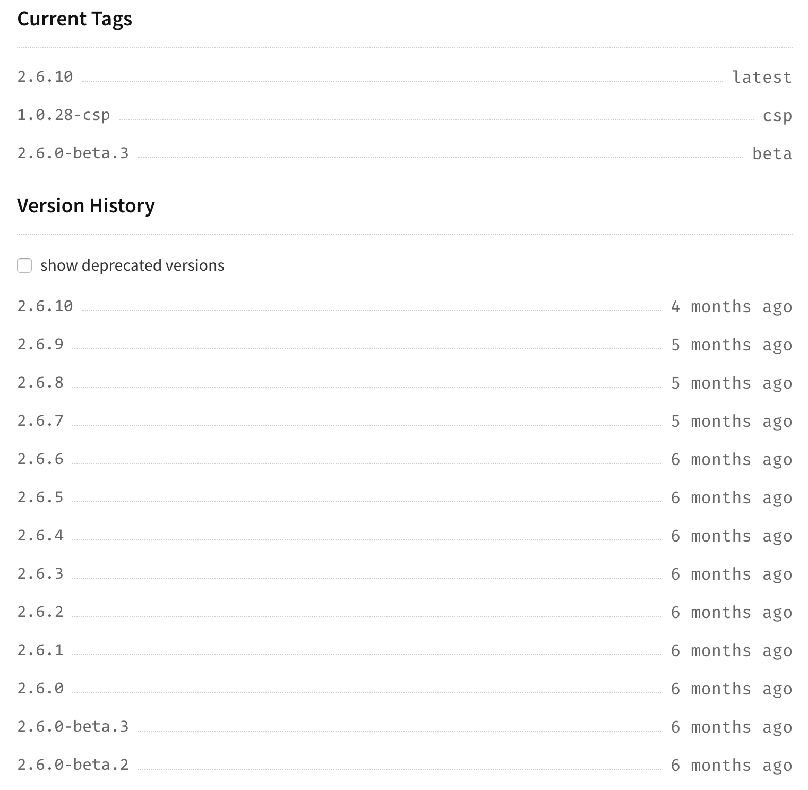
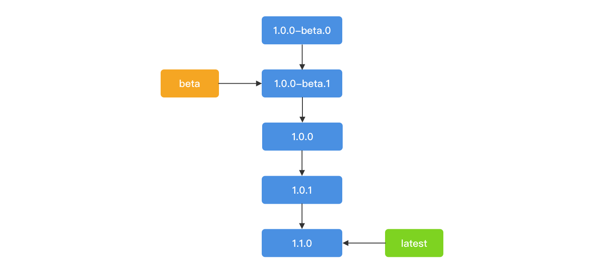
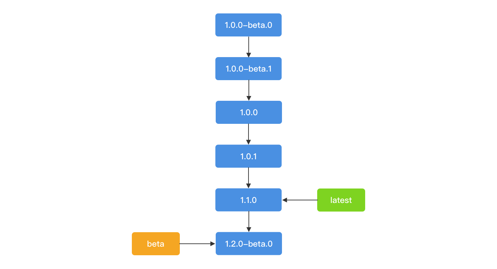
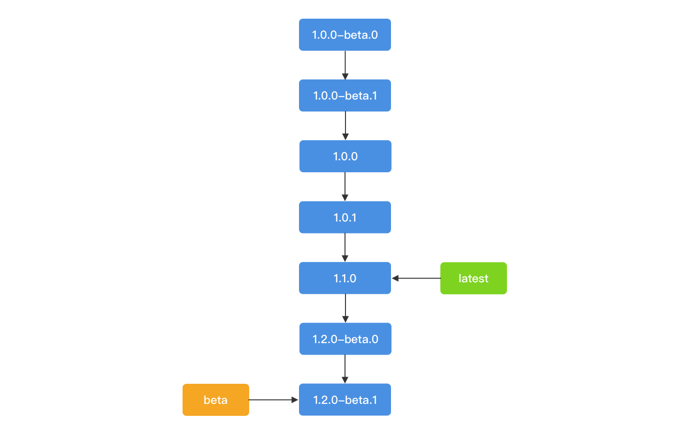
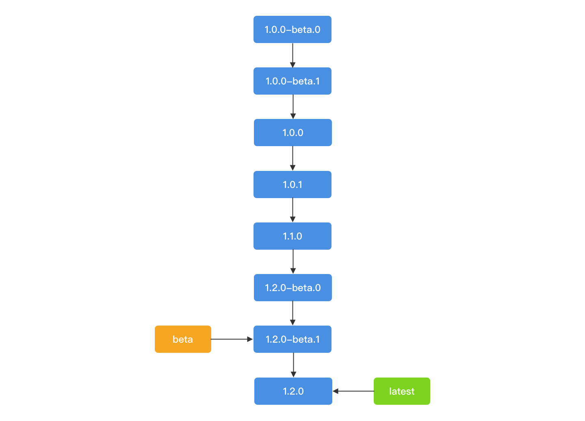
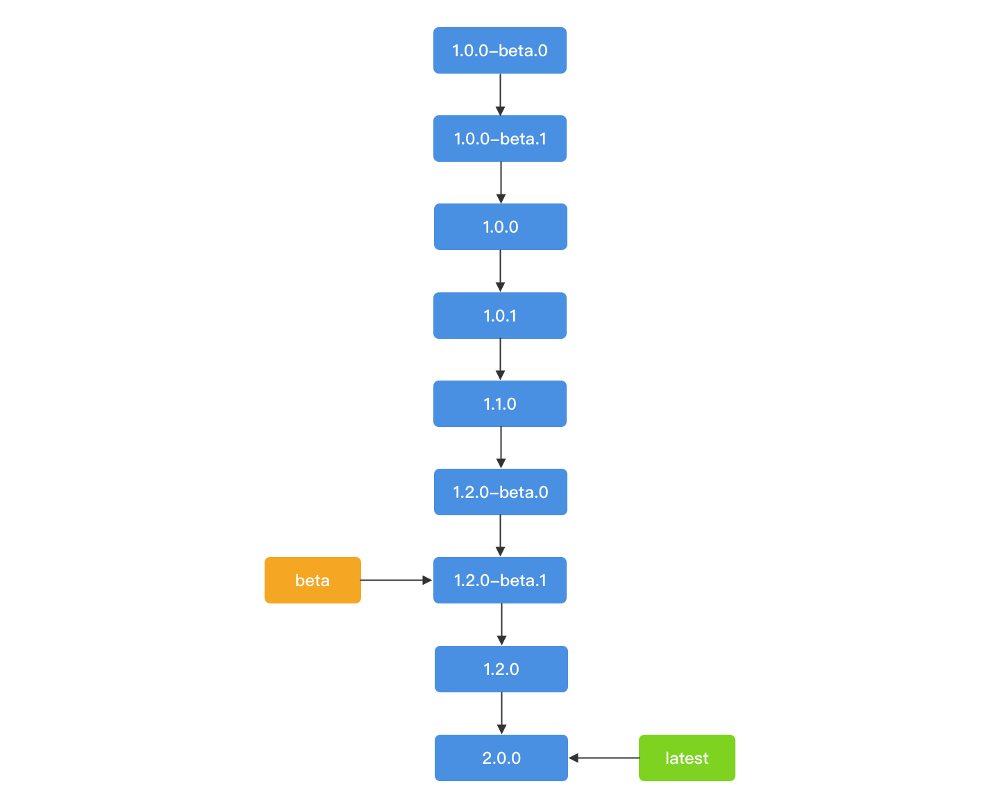

## 背景
目前项目组内没有一套版本管理规范来对`node package`进行规范，每个人对版本号的理解差异导致`package`版本号混乱，本文档将给出一套规范来解决该问题，并且在次规范的基础上给出一套`node package`发包最佳实践。
如果您对`node package`的语义化版本号已经非常了解，可直接跳到**最佳实践**部分开始阅读

**文档适用范围**：包括所有发布到npm(or ppnpm)上的node和前端package

## 语义化版本号说明
> major.minor.patch[-prerelease]
### 版本号组成
`node package`版本号由四部分组成：major.minor.patch[-prerelease]，比如：```1.0.2-beta.1```，其中`prerelease`可选。

- major：代表主版本号，通常在需要提交不能向下兼容的情况下对该版本号进行升级
- minor：代表次版本号，通常在新增功能时才对该版本号进行升级
- patch：代表修复版本号，升级该版本号通常代表修复一些bug，但没有新增功能或者存在不向下兼容的功能
- prerelease：带有该版本号的包通常表示在测试阶段，尚未稳定，通常不建议用户安装。

### prerelease说明
> alpha、beta、rc

通常我们会看到三种类型的`prerelease`，分别是：alpha、beta、RC，如：
```
1.1.0-alpha.1
1.1.0-beta.1
1.1.0-rc.1
```
每种类型的`prerelease`都有其特殊的含义，请不要乱用。
- alpha: 代表内部测试版，会有很多Bug，是比beta更早的版本，一般不建议对外发布
- beta: 相对alpha版本已有了很大的改进，但还是存在一些缺陷，需要经过多次测试来进一步消除
- rc：`Release Candidate`顾名思义就是正式发布的候选版本。和Beta版最大的差别在于Beta阶段会一直加入新的功能，但是到了RC版本，几乎就不会加入新的功能了，而主要着重于除错!  RC版本是最终发放给用户的最接近正式版的版本，发行后改正bug就是正式版了，就是正式版之前的最后一个测试版

### 配合Tag灵活控制版本输出
思考一个问题：**npm install <pkg>，会安装哪个版本的`package`？** 最新版本？
其实`node package`也有tag的功能，跟git的tag有点类似，目的就是给某个版本的`package`打标签。通过npm dist-tag ls指令可以查看某个`package`的所有tag，以vue为例：
```
> npm dist-tag ls vue
beta: 2.6.0-beta.3
csp: 1.0.28-csp
latest: 2.6.10
```
tag包括内置类型和自定义类型，其中latest就是内置tag，csp和beta为自定义tag。默认情况下latest指向最新版本的`package`，当然我们可以手动修改latest指向的版本，这个我们后面讲。每次`npm publish`发包时都会将latest指向当前发布的`package`版本。至于beta和csp具体指向哪个版本的`package`，完全由我们自己决定。那么tag具体有什么作用？
    
1. 指定最新的稳定版本
    
`npm install`时除了指定某个version的`package`，也可以指定安装某个tag的`package`。以vue为例：
    


`npm install vue@latest`就会安装2.6.10版本。现在回答刚才的问题：“npm install <pkg>，会安装哪个版本的`package`？”答案是latest指向的version。因此，我们在版本迭代时始终让latest指向最新的稳定版本。

2. 指定最新的公测版本

一般pkg在发新版之前都会发布一些公测版让用户先尝鲜，比如`0.0.4-beta.0`，一方面是让用户体验新功能，另一方面尽早发现bug修复上线。而在此期间更新版本是相对频繁的，我们不可能每发布一个内测版本都通知内测人员修改版本号，我们可以使用自定义标签解决此类问题。beta tag始终指向最新的带有prerelease的版本。那么用户通过`npm install pkg@beta`就可以安装最新的内测版。
除了在npm publish时通过--tag参数的方式指定tag，我们还可以通过npm dist-tag add指令增加或者移动tag。
```
// 方式一
npm publish --tag beta
// 方式二
npm dist-tag add pkg@0.0.4-beta.1 beta
```
有一点需要特别注意：npm publish 时会自动将latest指向最新的版本包括带有prerelease的版本。为了不改变latest总是指向最新稳定版本的属性，请在publish beta版本时使用 --tag beta参数。

## 最佳实践
参考了目前流行框架（Vue、React、Taro）的版本管理方案，得出以下最佳实践。
### 约定
为了规范发包流程，我们做如下约定：
* 第一个稳定版本号为1.0.0
* beta版本号从0开始，比如：1.0.0-beta.0/2.1.0-beta.0
* 使用npm version工具进行版本升级
* prerelease只保留beta
* 只有 `latest` 和 `beta` 两个标签
* `latest` tag永远指向最新的稳定版本
* `beta` tag永远指向最新的公测版本
* 提交beta版本时，npm publish时必须加上 `--tag beta` 参数
* npm publish后需要给git仓库打tag，tag名称跟当前版本号一致

### 版本升级工具
> npm version [<newversion> | major | minor | patch | premajor | preminor | prepatch | prerelease [--preid=<prerelease-id>] | from-git]

npm 提供了自动升级版本号的工具：`npm version`，该工具会自动修改package.json内的版本号并且会自动 git commit， 因此使用该工具时请保持git status是clear的。
假设我们当前版本号为`0.0.1`，我们需要升patch号：
```
npm version patch
```
那么版本号就会变成`0.0.2`
`npm version major` 和 `npm version minor`同理，具体使用方法参考[官方文档](https://docs.npmjs.com/cli/version)。
其中`npm version prerelease`比较特殊，需要扩展说明下。

#### prerelease 版本升级
> npm version prerelease

假设当前版本号为`0.0.1`，执行 `npm version prerelease` 后，版本号将变为`0.0.2-0`，再执行`npm version prerelease`，版本号将变为`0.0.2-1`，以此类推。
但是如何升级成类似`0.0.2-beta.1`的形式？可以尝试使用 `--preid` 选项，但前提是您本地的npm版本需要大于6.4.0
```
// npm 6.4.0 以后可以使用 --preid 选项
npm version prerelease --preid=beta
```
`0.0.1`将变为`0.0.2-beta.0`，您也可以选择手动升级：
```
npm version prerelease 0.0.2-beta.0
```
这不是明智的选择，我们依然推荐您将npm升级到6.4.0以上的版本，升级方式：
```
npm i -g npm@latest
```

### 案例
#### 第一个beta版本
我们目前有个`package`名称是ossa，第一个版本之前有两个beta版本，那么项目初始化时确保package.json里版本号为1.0.0-beta.0，publish指令：`npm publish --tag beta`。


git tag：
```
git tag 1.0.0-beta.0
```
#### 第二个beta版本
接下来会通过`npm version prerelease --preid=beta`进行beta版本升级，升级后版本号将变为1.0.0-beta.1，publish指令：`npm publish --tag beta`。


git tag：
```
git tag 1.0.0-beta.1
```
#### major版
两个beta版本后需要发布稳定版本1.0.0，请使用指令`npm version patch`，版本号将变为1.0.0，publish指令：`npm publish`。


git tag：
```
git tag 1.0.0
```
#### 修复版本
接着会发布一个patch版本，请使用指令`npm version patch`，版本号将变为1.0.1，publish指令：`npm publish`。


git tag：
```
git tag 1.0.1
```
#### minor版本
接着会发布一个minor版本，请使用指令`npm version minor`，版本号将变为1.1.0，publish指令：`npm publish`。



git tag：
```
git tag 1.1.0
```
#### minor的beta版
发布1.2.0之前会发布一个1.2.0的beta版，此时请不要使用`npm version prerelease --preid=beta`，因为这会导致版本号变为`1.1.1-beta.0`，请使用指令`npm version 1.2.0-beta.0`直接指定，publish指令：`npm publish --tag beta`。



git tag：
```
git tag 1.2.0-beta.0
```
#### 第二个minor的beta版
接下来所有1.2.0的beta版都可以通过`npm version prerelease --preid=beta`指令自动升级，比如升级到1.2.0-beta.1，publish指令：`npm publish --tag beta`。



git tag：
```
git tag 1.2.0-beta.1
```
#### 第二个minor版
接着发布1.2.0稳定版，请使用指令`npm version minor`，版本号将变为1.2.0，publish指令：`npm publish`。



git tag：
```
git tag 1.2.0
```

#### 第二个major
接着发布2.0.0稳定版，请使用指令`npm version major`，版本号将变为2.0.0，publish指令：`npm publish`。



git tag：
```
git tag 2.0.0
```

#### 修正tag指向
如果发包时出现tag指向错误的情况，比如：当前包版本为1.0.0


发beta包时没有加`--tag beta`参数，tag指向将变为：


此时，可使用`npm dist-tag add`指令修改tag指向：
```
npm dist-tag add ossa@1.0.0 latest
npm dist-tag add ossa@1.0.1-beta.0 beta
```
修改后tag指向：


上面的例子已包括了常见的发包情形，后面的以此类推，请在发包时严格遵守。


## 参考文章
1. [node-semver](https://github.com/npm/node-semver#prerelease-identifiers)
2. [npm-version](https://docs.npmjs.com/cli/version?source=post_page---------------------------)